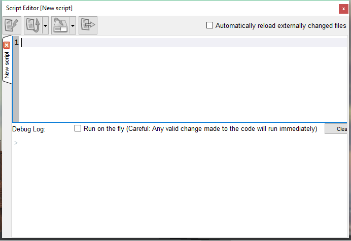
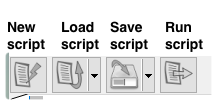
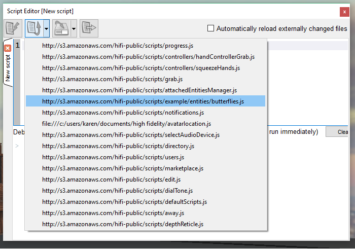
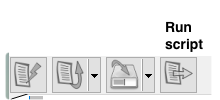
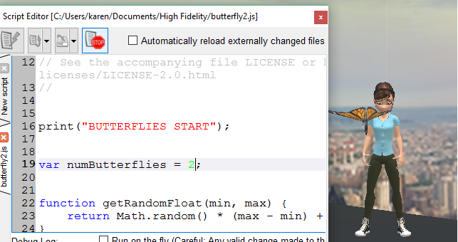

Interface used to contain a script editor. This tutorial utilizes that script editor to create butterflies. You can write and run the same script mentioned here, in a script editor of your choice. All you need to do is go to Edit > Open and Run Script. Here, you can upload the script you wish to run. Also, included with High Fidelity are example scripts. One example script, `butterflies.js` gives your avatar a kaleidoscope of butterflies to keep it company.

> > > > > The information here is outdated when it comes to using Interface's script editor. The concept behind creating butterflies still applies. 

## Loading and Running butterflies.js

Before getting into editing the `butterflies.js` script, start by running the script in Interface to see what it does. To run the script in Interface, complete these steps:

1. Start Interface and navigate to a domain where you have access to add entities.
2. From the "Settings Menu" click "Advanced Menus"
3. In Interface select **Edit > Running Scripts** or press **Ctrl + J** to open the *Running Scripts* panel.
4. In the *Running Scripts* panel, navigate to the `butterflies.js` script in the `tutorials` folder and click on it to highlight it.
5. Click **Load** to run the script.

You should see the `butterflies.js` script added to the list of running scripts at the top of the *Running Scripts* panel. In world, you should see a group of butterflies appear directly in front of your avatar that then begin to float up and away.


*Note: As the script is being run as an Interface script, the results (the butterflies flying around you) are seen by everyone in the domain. For information about running scripts in other contexts and what that means for what others can see, take a look at Scripts Overview.*

## Opening the Script in the Script Editor

Included in Interface is a basic script editor. The script editor provides you with an interface for quickly editing scripts and then running them. To open the example script in the script editor, complete the following steps:

1. Select **Settings** and ensure that **Advanced Menus** is enabled.

2. Select


   Edit > Script Editor...

   . This opens the script editor window. The script editor includes an editing panel, a debug log, and options to run the scripts on the fly as you edit.



   The script editor has several icons across the top that allow you to create a new script, load a script, save a script, and toggle running the script.



3. Select the arrow next to the load script icon. You should see a dropdown list of all currently running scripts.

4. Select the    script from the list.


   ```
   butterflies.js
   ```

​    

   Loading butterflies.

5. You will be prompted to save the script locally, so pick a memorable name (for example, `butterfly2.js` ) and press **Save**.

You now have a local copy of the script open in the script editor.

## Running the Script Using the Script Editor

Now that you have a local copy of the script that you can experiment with, the first step is to make sure that the local copy of the script runs.

- To run the local copy of the script, in the script editor, click the **Run Script** icon - it looks like a piece of paper with a straight arrow to the right.



The Run Script icon.

The **Run Script** icon should change to the **Stop Script** icon (a small stop sign). As the script is now running, you should see more butterflies appearing in front of the avatar.


The Stop Script icon.

With both the original script and the local copy of the script running, you should now have twice as many butterflies swarming around your avatar. In the *Running Scripts* panel you should see both the original script `butterfly.js` and the new script `butterfly2.js` listed.As you go forward, to get a better idea of what is going on, you should stop both scripts:

- To stop the local script - press the **Stop Script** icon the in the script editor.
- To stop the original script, press the stop icon (the X) next to the script in the *Running Scripts* window.

For the purposes of this document, you'll be running and stopping the butterfly script from the script editor.

## Editing the Script Using the Script Editor

This section covers making a simple edit to the script as an example of how to use the script editor. Before you begin:

- Make sure **Run on the fly** is unchecked in the script editor, as this script can cause Interface to crash.

The butterflies are pretty, but there are a lot of them. A simple edit to make is to change the number of butterflies to a manageable number, like two. Set the `numButterflies` to `2`.

```
// Distributed under the Apache License, Version 2.0.
// See the accompanying file LICENSE or http://www.apache.org/licenses/LICENSE-2.0.html
//

var numButterflies = 2; //a more manageable number

function getRandomFloat(min, max) {
    return Math.random() * (max - min) + min;
}

```

Re-run the script (click the **Run Script** icon).



You should now see only two butterflies appear.

## Using the Debug Log

Logs are an indispensable part of any scripting. You might have noticed that the script editor's debug log was pretty empty while running `butterfly2.js`.

You can use the `print()` function to see data in the debug log. For example you can add a command to print towards the end of the function `addButterfly()` (around line 97) to indicate when a butterfly has been added.

```
function addButterfly() {

// ...

  butterflies.push(Entities.addEntity(properties));
    print("Butterfly added!");
}

```

Run the script, and notice the debug log now says:

```
> Butterfly added!
> Butterfly added!

```

Your avatar should now have the same number of butterflies around as `Butterfly added!` statements in the log.

For testing purposes, it would be nice to know the coordinates of the butterflies as they appear. Directly above the print statement is a promising line:

`butterflies.push(Entities.addEntity(properties));`

Looking at the definition of `properties` in the code section just above this line, `properties.position` seems to be the position of the new butterfly entity. (For more information see [addEntity()](https://docs.highfidelity.com/api-reference/namespaces/entities#example).)

To print out the butterfly position, try adding `properties.position` to the print statement:

```
print("Butterfly added at: " + properties.position);

```

Take a look at the output:

```
> Butterfly added at: [object Object]
> Butterfly added at: [object Object]

```

This isn't very human-readable. To improve readability, you can use JSON.stringify():

```
print("Butterfly added at: " + JSON.stringify(properties.position));

```

The output looks a bit nicer now:

```
> Butterfly added at: {"x":6227.20556640625,"y":222.0852508544922,"z":3986.543701171875}
> Butterfly added at: {"x":6228.36962890625,"y":222.44215393066406,"z":3987.716064453125}

```

You can clear the debug log between script runs by clicking the **Clear** button at the top-right of the debug log panel.

## Loading and Running the Local Copy of the Script

After some time you will be butterfly-less. They have a limited lifespan and may have died out naturally. Perhaps you wanted to have some time by yourself and ended their script. Either way, you're probably far from your initial location and would like to once again experience butterflies.

If you want to run but not edit your modified script (`butterfly2.js):

1. In Interface select **Edit > Running Scripts** or press **Ctrl + J** to open the *Running Scripts* panel.
2. In the *Running Scripts* panel, select **From Disk** and then navigate to the `butterfly2.js` script, select it, and click **Open**.

As you are running the modified script, two butterflies should appear around you.

If you would like to edit your file before running it:

1. Open the script editor, click the **Load Script** icon (second one from the left) and then selecting your script from the explorer/finder.
2. Once the script is loaded in the editor, click the **Run Script** icon to run the script.